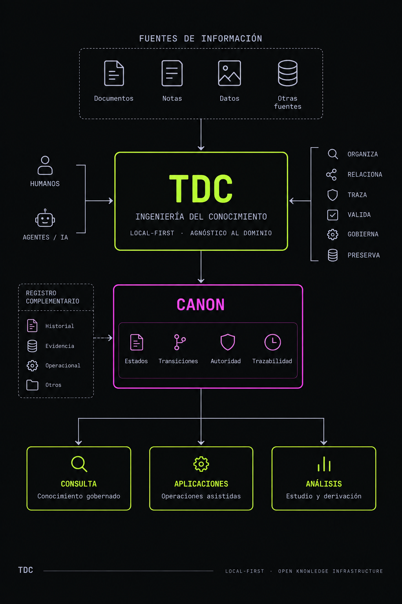
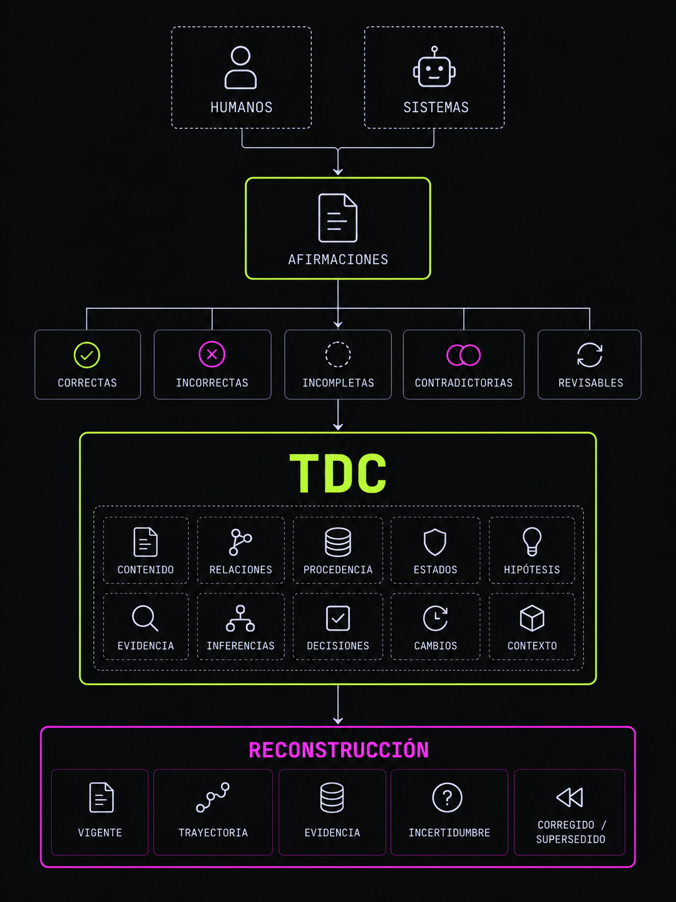
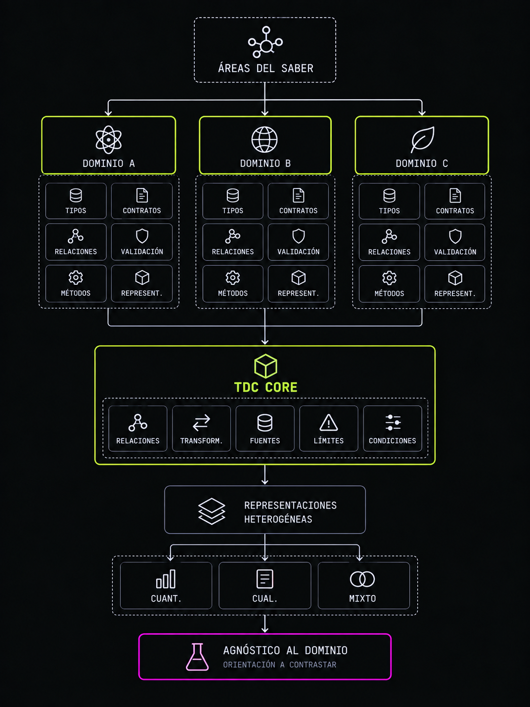
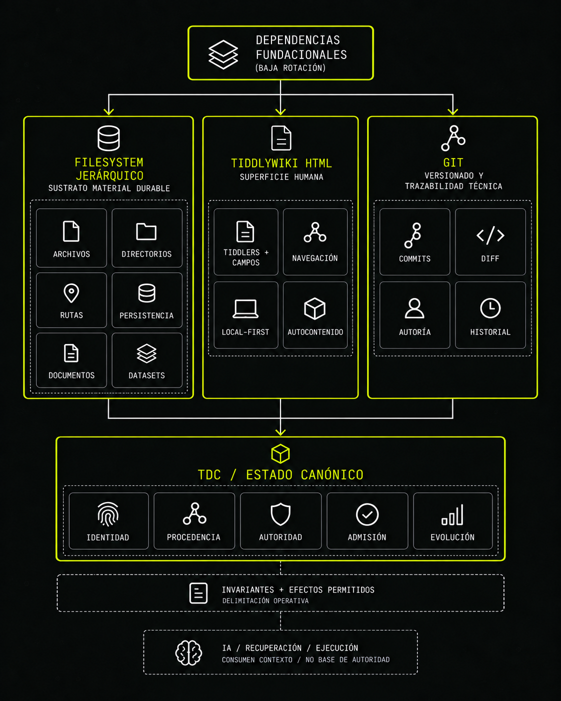
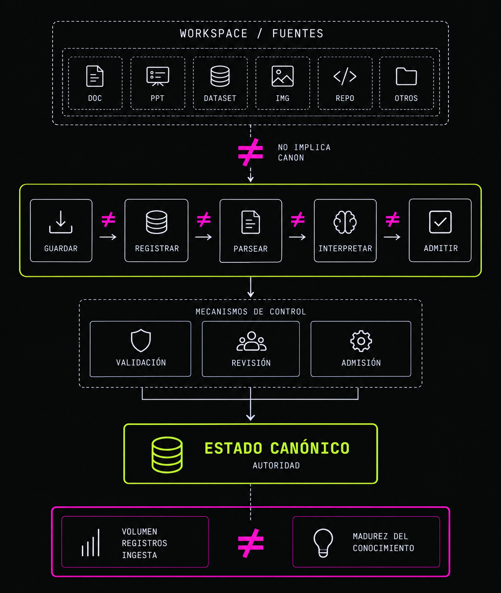
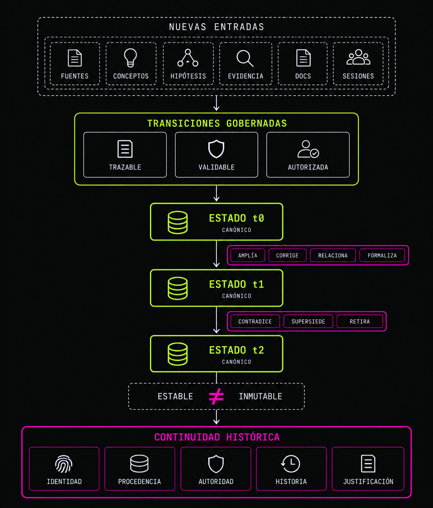
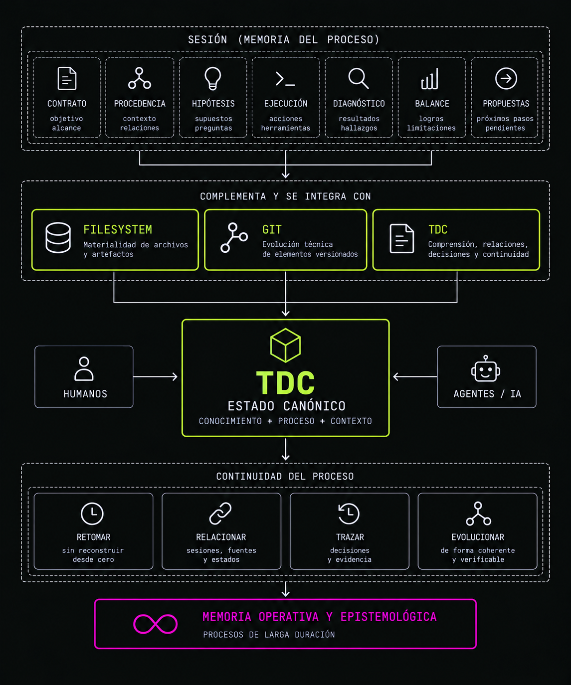
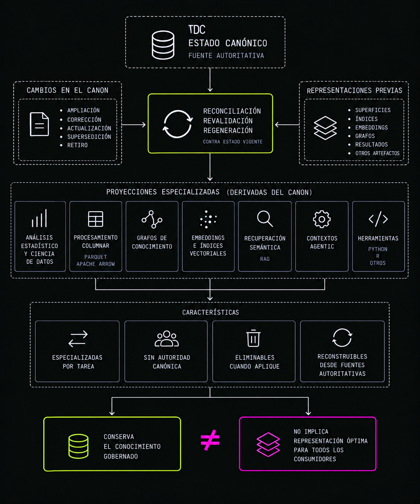
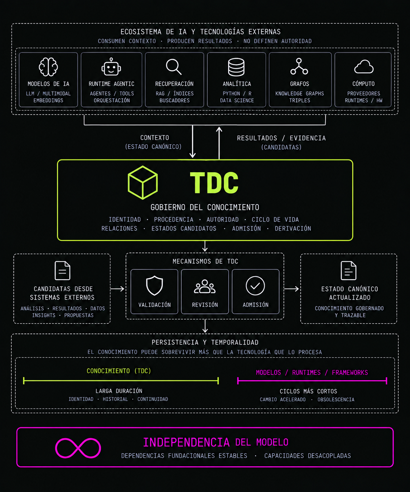
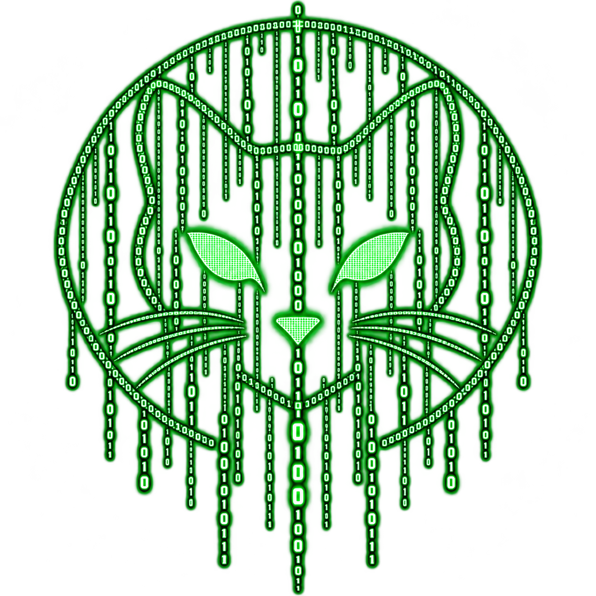

<div align="center">


<p>
  
</p>

_`La memoria es el residuo del pensamiento`_

 _`Daniel Willingham`_

# tiddly-data-converter (TDC)

</div>

TDC es una infraestructura local-first de ingeniería del conocimiento, agnóstica respecto al dominio, diseñada para transformar información fragmentada en una memoria semántica organizada, auditable, consultable, y para preservar comprensión y continuidad en procesos de conocimiento de larga duración. Su Canon representa estados de conocimiento admitidos como referencia vigente mediante transiciones válidas de autoridad y admisión, sin confundirse con la totalidad del registro histórico, evidenciario u operacional que puede acompañarlos. La autoridad canónica determina qué estado puede utilizar TDC como base para operaciones que requieren conocimiento gobernado; no constituye por sí misma una declaración de verdad absoluta, certeza epistemológica o consenso universal.



TDC parte de una premisa de falibilidad: tanto humanos como sistemas computacionales pueden producir afirmaciones correctas, incorrectas, incompletas, contradictorias o susceptibles de revisión. Por ello, preserva no solo contenido, sino también relaciones, procedencia, estados epistemológicos, hipótesis, evidencias, inferencias, decisiones, cambios y contexto de producción, de forma que pueda reconstruirse no solo qué conocimiento se considera vigente, sino también cómo se llegó a ese estado, qué evidencia lo sostuvo, qué incertidumbres permanecieron y qué estados anteriores fueron posteriormente corregidos o supersedidos.



Puede utilizarse para estudiar, desarrollar y estructurar cualquier área del saber, y para soportar enfoques metodológicos cuantitativos, cualitativos o mixtos. TDC se diseña para no presuponer que dominios distintos deban compartir una misma semántica: estos pueden especializar tipos de objeto, contratos semánticos, relaciones, reglas de validación, métodos de análisis y representaciones sin exigir que el núcleo adopte la semántica particular de una disciplina. Hacer conocimiento computable no significa reducir todas sus formas a una única representación, sino hacer explícitas las relaciones, transformaciones, fuentes, límites y condiciones necesarias para que representaciones heterogéneas puedan utilizarse sin perder su significado ni su estatuto epistemológico.



TDC se construye deliberadamente sobre un conjunto reducido de dependencias fundacionales de baja rotación.
- El filesystem jerárquico convencional constituye su sustrato material local y durable para preservar archivos, documentos, datasets, repositorios, sesiones, artefactos y otros estados persistentes, sin que su ubicación física determine por sí sola su significado o autoridad. TDC depende de las propiedades generales de archivos, directorios, rutas y persistencia, y no de una implementación particular del filesystem o de un sistema operativo específico.
- [Git](https://git-scm.com/) constituye la dependencia fundacional para el versionado y la trazabilidad de la evolución técnica de los artefactos sometidos a control de versiones, preservando localmente estados, diferencias, metadatos de autoría y revisión, y relaciones históricas entre revisiones. Su historial aporta evidencia técnico-histórica, pero no sustituye la procedencia epistemológica, la admisión ni la autoridad canónica de TDC.
- [TiddlyWiki](https://github.com/TiddlyWiki), utilizado principalmente mediante su representación HTML autocontenida, constituye la superficie humana fundacional de TDC. Su selección es deliberada: se trata de un cuaderno programable, autónomo y de código abierto cuya unidad básica, el tiddler, combina contenido direccionable, campos arbitrarios, filtros, plantillas y transclusión parametrizada. Sobre esta base, TiddlyWiki proporciona navegación no lineal, composición extensible del conocimiento y una representación local-first capaz de conservarse y utilizarse independientemente de los sistemas de inteligencia artificial, recuperación o ejecución que puedan rodearla. Estas propiedades resultan relevantes tanto para los humanos como para los usuarios computacionales. Los humanos pueden componer vistas coherentes a partir de pequeñas unidades de conocimiento reutilizables sin necesidad de duplicar su contenido. Los sistemas computacionales, a su vez, pueden aprovechar la misma semántica de composición para construir contextos delimitados y específicos para cada tarea, preservando al mismo tiempo la identidad y la procedencia de las fuentes incluidas.TiddlyWiki se distingue, para los propósitos de TDC, porque estas capacidades coexisten de forma nativa con la transclusión filtrada y parametrizada, los campos arbitrarios de los tiddlers, un entorno programable basado en WikiText y widgets, y una representación HTML completa y autónoma. Esta combinación permite que la misma superficie actúe simultáneamente como artefacto humano navegable, medio de composición y representación persistente del conocimiento.

TDC no pretende abstraerse de estas dependencias por principio. Su objetivo es delimitar explícitamente, mediante invariantes y efectos permitidos, el ámbito operativo de cada una y distinguirlo de las responsabilidades propias del sistema. En particular, TDC conserva bajo su propio gobierno aquello que afecta a la identidad, la procedencia, la autoridad, la admisión y la evolución del estado canónico.



La existencia de una fuente o artefacto dentro del workspace no implica que deba convertirse íntegramente en Canon. Documentos, presentaciones, datasets, imágenes, repositorios de software y otros activos pueden conservarse o referenciarse como fuentes durables, mientras parsers, extractores y herramientas especializadas producen representaciones computables cuando una tarea lo requiere. Guardar no equivale a registrar; registrar no equivale a parsear; parsear no equivale a interpretar; e interpretar no equivale a admitir. Solo los estados de conocimiento que atraviesan los mecanismos correspondientes de validación, revisión y admisión adquieren autoridad canónica. Esta separación permite conservar ampliamente fuentes y evidencia sin confundir volumen de información, número de registros o capacidad de ingestión con madurez del conocimiento.



El Canon de TDC es evolutivo por diseño. A medida que el conocimiento se amplía, corrige, relaciona o formaliza mediante nuevas fuentes, conceptos, hipótesis, evidencias, procedimientos, documentos, diagnósticos o sesiones de trabajo, su estado canónico puede evolucionar mediante mecanismos trazables, validables y explícitamente autorizados. Su estabilidad no consiste en permanecer inmutable, sino en cambiar sin perder identidad, procedencia, autoridad ni continuidad histórica. Un estado previamente admitido puede ser contradicho, corregido, supersedido o retirado sin que desaparezca la posibilidad de comprender por qué fue utilizado como referencia en un momento determinado y qué evidencia o decisión justificó posteriormente su modificación.



Las sesiones forman parte de esta memoria estructurada del proceso epistemológico y operativo. Sus contratos, procedencia, hipótesis, detalles de ejecución, diagnósticos, balances y propuestas permiten conservar qué se pretendía hacer, bajo qué límites, qué ocurrió realmente, qué decisiones se tomaron, qué evidencia apareció, qué quedó sin resolver y qué debería ocurrir después. Esta memoria complementa al filesystem y a Git: el filesystem preserva la materialidad de archivos y artefactos, y Git registra con gran precisión la evolución técnica de los elementos versionados, mientras TDC busca preservar la comprensión, las relaciones, las decisiones y la continuidad necesarias para que humanos y sistemas computacionales puedan retomar procesos de larga duración sin reconstruir desde cero toda su historia.



Cuando el Canon cambia, las representaciones y superficies que dependan de ese estado deben reconciliarse, revalidarse o regenerarse contra el estado canónico vigente antes de utilizarse nuevamente como base para operaciones que requieran currentness. El Canon no necesita ser la representación óptima para todos los consumidores: a partir de él pueden construirse proyecciones especializadas para análisis estadístico y ciencia de datos, procesamiento columnar, grafos, embeddings, recuperación semántica o contextos agentic. Formatos como Parquet o Apache Arrow, herramientas como Python o R, sistemas RAG, índices vectoriales y grafos de conocimiento pueden especializarse en determinadas tareas sin adquirir por ello autoridad sobre el conocimiento del que derivan. Cuando su naturaleza lo permita, estas representaciones deben poder eliminarse y reconstruirse desde fuentes autoritativas sin pérdida de conocimiento gobernado.



El Canon es independiente del modelo de inteligencia artificial, runtime agentic, sistema de recuperación, proveedor de cómputo o tecnología analítica utilizada. TDC gobierna propiedades como identidad, procedencia, autoridad, ciclo de vida, relaciones, estados candidatos, admisión y derivación; los sistemas externos consumen contexto y producen resultados, evidencia, análisis o nuevas candidatas sometidas a esos mecanismos. La persistencia en una memoria agentic, un índice, un grafo, un sistema RAG o cualquier otro servicio externo no confiere por sí misma autoridad canónica. Esta separación responde además a una asimetría temporal: el conocimiento puede necesitar sobrevivir durante más tiempo que los modelos, runtimes, frameworks, proveedores, formatos especializados o generaciones de hardware que lo procesan. TDC no busca independencia de toda tecnología, sino mantener deliberadamente estables sus dependencias fundacionales y desacopladas aquellas capacidades cuya velocidad de cambio es mayor.



## Ejecución

Desde la raíz del repositorio, usar ejecutable:

```bash
src/shell_scripts/tdc.sh
```

Este comando invoca de forma guiada al orquestador de admisión, al canonizador, al reverse y los scripts existentes; muestra métricas y exige confirmaciones robustas antes de cualquier acción que pueda escribirse en el canon local.

## Licencia
El software first-party de TDC se distribuye bajo `AGPL-3.0-or-later`. Consulte [LICENSE](LICENSE) y [LICENSE_SCOPE.md](docs/LICENSE_SCOPE.md) para el alcance, incluidos los límites entre software, datos y materiales de terceros.

<div align="center">

---

<p>
  
</p>

_`sic parvis magna`_


</div>
